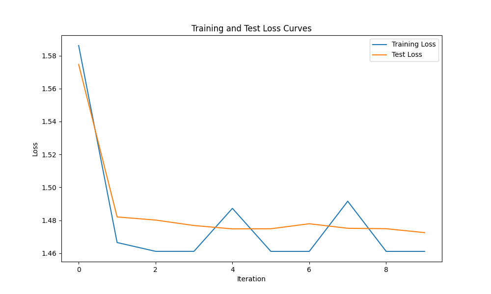

# Digit Classification

吴舒文 521030910087

## Hyperparameters

Using Adam optimizer with  learning_rate = 0.001 and other default parameters. 

Training features set to num_epochs = 10, batch_size = 64. 

## Results

Test accuracy: 98.85%

